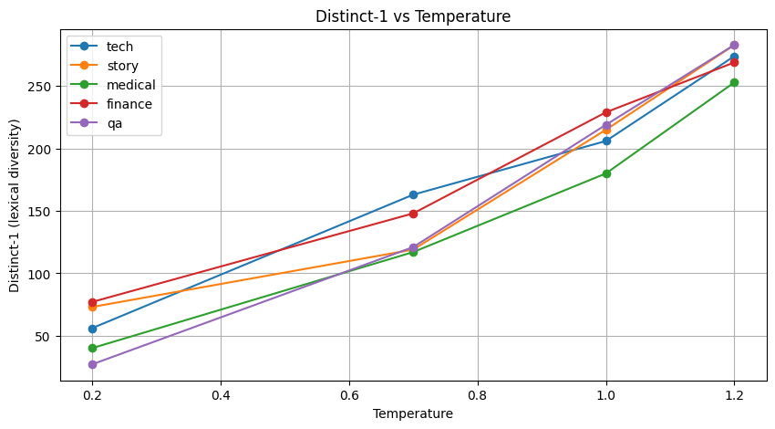
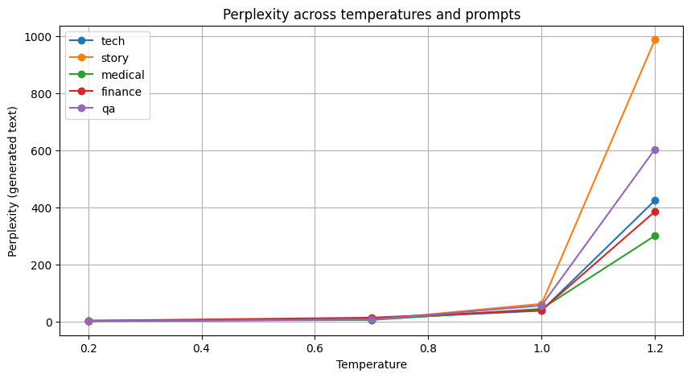
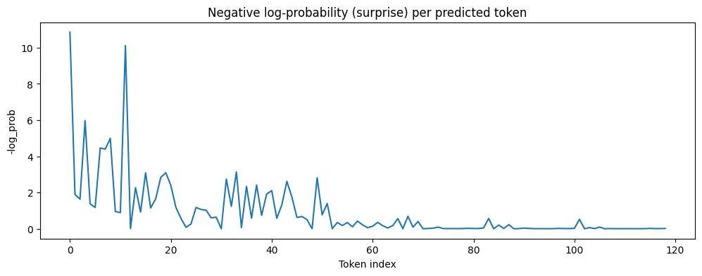
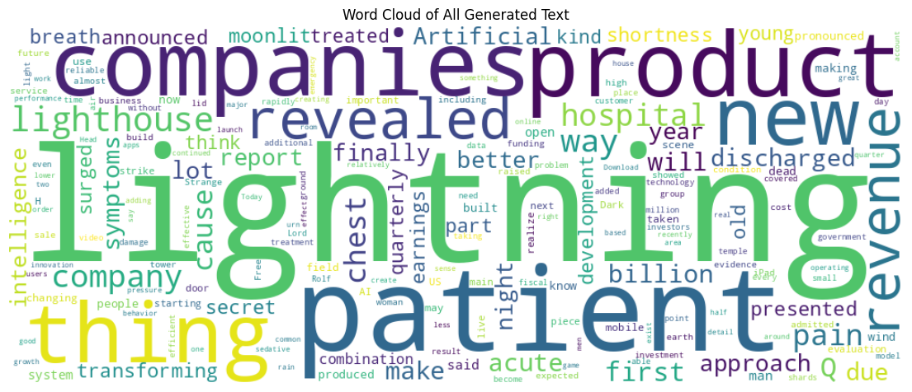

# GPT-2 Language Model Exploration & Analysis — ShadowFox AIML Internship (Advanced Task)

This repository contains a complete Google Colab implementation of GPT-2.  
The goal is to analyze how GPT-2 generates language, how well it understands context,  
and how its behavior changes with temperature and domain-specific prompts.

---
[Open in Colab]([https://colab.research.google.com/…](https://colab.research.google.com/drive/1XTZACHnnNVQDIXSx0N8rIhzWn-nL-C5d))  
----
## 🔹 Project Summary

| Item | Status |
|------|:-----:|
| Large Language Model | GPT-2 |
| Notebook Name | `GPT2_analysis.ipynb` |
| Framework | Hugging Face Transformers |
| Device | GPU (if enabled in Colab) |

This notebook showcases:
✅ Text generation experiments  
✅ Perplexity scoring  
✅ Lexical diversity measurement  
✅ Repetition analysis  
✅ Visualizations (word cloud, token confidence, performance charts)  
✅ Ethical considerations + conclusions  

---

## 📌 Key Experiments

We tested GPT-2 on different prompts:

- Technology
- Story / narrative
- Medical domain
- Q&A format

And compared across multiple **temperature** settings:

### Observed Effects:
| Temperature ↑ | Creativity ↑ | Accuracy ↓ | Hallucination ↑ |
|:------------|:------------:|:----------:|:---------------:|
| ✅ More surprising output | ❌ Less factual |

### Domain Knowledge:
| Domain | Performance |
|--------|:-----------:|
| Story | ⭐⭐⭐⭐ |
| Tech | ⭐⭐⭐ |
| Medical | ⭐⭐ (hallucination risk) |

---

## 📊 Visual Results Included

- Perplexity vs Temperature Plot
- Distinct-1 Diversity Chart
- Token Confidence Curve
- Word Cloud of All Generated Text

These help demonstrate **strengths and weaknesses** in GPT-2 reasoning.

---

## 🔍 Research Questions

The notebook answers:
1️⃣ How does temperature impact text quality?  
2️⃣ Does GPT-2 maintain context over longer sequences?  
3️⃣ How bad is GPT-2 on domain-specific tasks (medical)?  

Each question is supported with:
✔ Metrics  
✔ Output examples  
✔ Visualizations  

---

## ⚠ Ethical Considerations

GPT-2:
- Produces **confident but false information**
- May generate biased/harmful text
- Not suitable for critical domains without safeguards

This is documented in the analysis section.

---

## ✅ Proof of Work Deliverables

| Requirement | Provided |
|------------|:--------:|
| Colab Notebook | ✅ |
| Experiment Results | ✅ |
| Visualizations | ✅ |
| Ethical + Research insights | ✅ |
| Screenshots for submission | ✅ Required separately |
| LinkedIn Proof of Work video | ✅ Required separately |

---

## ▶ How to Run This Notebook

1️⃣ Open `GPT2_analysis.ipynb` in Google Colab  
2️⃣ Runtime → Change Runtime Type → GPU  
3️⃣ Run all cells in order  
All dependencies auto-install inside the notebook.

No local setup required.

---
## 📸 Output & Visual Results

Below are sample visualizations from the GPT-2 analysis:

### ✅ Word Cloud (Generated Text)

### ✅ Perplexity vs Temperature

### ✅ Token Confidence Visualization

### ✅ Example Generation Output

----
## 👤 Author

**Ani**  
ShadowFox AIML Intern  
Project Type: **Advanced Level — Language Model Deployment & Evaluation**

---

⭐ If you found this useful, star the repo!
